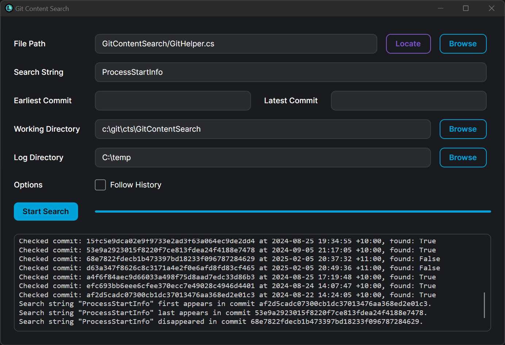

# GitContentSearch

## Overview

**GitContentSearch** is the ideal tool if you've ever wanted to do `git blame` on Excel files. This tool comes in two flavors - a command-line interface (CLI) and a graphical user interface (UI). It allows you to efficiently search for content across different Git commits in Excel files (.xls, .xlsx) and text files (.txt, .sql, .cs, etc.), making it a powerful solution for tracking changes even in non-text formats.

The app identifies the commit where the search string appears, using an optimized binary search algorithm for faster results in large commit histories. Progress is logged to a file, allowing you to resume the search if interrupted.

> **Note**: Currently, the application has been primarily tested on Windows and may not work properly on Linux/MacOS. Cross-platform support is planned for future releases.



## Features

- **Two Interfaces**: Choose between a CLI for automation and scripting, or a modern UI for a more visual experience.
- **Optimized Search**: Quickly identifies the commit where the search string first appears and last disappears.
- **Searches Across Multiple File Types**: Search in Excel files (.xls, .xlsx) and text files (.txt, .sql, .cs, etc.).
- **Log File**: Keeps track of all checked commits and results, allowing you to continue the search later.
- **Date Range**: Specify start and end dates to limit the search scope (with fallback to commit range in CLI).
- **Follow File History**: Use the `--follow` option (CLI) or toggle in UI to follow file renames and history across commits.

## Download Windows Binaries

You can download the Windows binaries from the releases page:

- **CLI**: [GitContentSearch_CLI_win_x64.zip](https://github.com/EntityProcess/GitContentSearch/releases/latest)
- **GUI**: [GitContentSearch_UI_win_x64.zip](https://github.com/EntityProcess/GitContentSearch/releases/latest)

If you don't trust the binaries, you can perform the build steps below.

## Installation

**Clone the repository**:

```bash
git clone https://github.com/entityprocess/GitContentSearch.git
cd GitContentSearch
```

**Build the application**:

```bash
dotnet publish -c Release
```

### CLI Installation

The CLI executable will be available at:
```
/path/to/your/git/repository/GitContentSearch/bin/Release/netX.X/publish/
```

Add this folder to your PATH environment variable to run the tool from any directory in your command line.

### UI Installation

The UI executable will be available at:
```
/path/to/your/git/repository/GitContentSearch.UI/bin/Release/netX.X/publish/
```

For easy access, you can create a shortcut to `GitContentSearch.UI.exe` on your desktop from the publish folder.

## Usage

### UI Version

1. Launch `GitContentSearch.UI.exe`
2. Configure your Git repository settings
3. Enter the file path and search string
4. Set the date range using the date picker or enter dates manually (format: YYYY-MM-DD)
5. Click Search to begin

### CLI Version

**1. Navigate to your Git directory**:
  
Before running the tool, ensure you're in the directory where your Git repository is located:

```bash
cd /path/to/your/git/repository
```

**2. Run the tool**:

```bash
GitContentSearch.exe <remote-file-path> <search-string> [--start-date=<date>] [--end-date=<date>] [--earliest-commit=<commit>] [--latest-commit=<commit>] [--working-directory=<path>] [--log-directory=<path>] [--follow]
```

### CLI Arguments

* `<file-path>`: The path to the Content file within the Git repository.
* `<search-string>`: The string you want to search for in the Content file.
* `--start-date=<date>`: (Optional) The start date for the search (format: YYYY-MM-DD).
* `--end-date=<date>`: (Optional) The end date for the search (format: YYYY-MM-DD).
* `--earliest-commit=<commit>`: (Optional) The earliest commit to begin the search (takes precedence over date range if both are specified).
* `--latest-commit=<commit>`: (Optional) The latest commit to end the search (takes precedence over date range if both are specified).
* `--working-directory=<path>`: (Optional) The directory where Git commands should be executed. Defaults to the user's temp directory if not provided.
* `--log-directory=<path>`: (Optional) The directory where the log file and temporary files will be stored. Defaults to the user's temp directory if not provided.
* `--follow`: (Optional) Follow file renames and history across commits.

### CLI Example

```bash
GitContentSearch.exe "path/to/your/file.xlsx" "SearchString" --start-date="2023-01-01" --end-date="2023-12-31" --working-directory="/your/git/repo" --log-directory="/your/log/directory" --follow
```

This will search for the string "SearchString" within the specified date range, using the specified working directory for Git operations and storing logs and temporary files in the specified log directory.

Note: The file is the remote path (e.g. `path/to/your/file.xlsx`), not the local path (e.g. `c:/repo/path/to/your/file.xlsx`). All dates are handled in UTC timezone.

## Output

Search Log: A file named search_log.txt is created in the log directory, detailing the commits checked and whether the string was found. The log directory is also used to store any temporary files generated during the search process.

## Dependencies

* Git: Make sure Git is installed on your system, as the app relies on the git show command.
* NPOI: [NPOI](https://github.com/nissl-lab/npoi) is a .NET library that provides support for reading and writing Microsoft Office formats, including Content (.xls, .xlsx). It's used in this project to process Excel files.
* AvaloniaUI: The UI version is built using [AvaloniaUI](https://avaloniaui.net/), a cross-platform UI framework for .NET.

## Contributing

Contributions are welcome! Please feel free to submit a pull request or open an issue for any bugs or feature requests.
