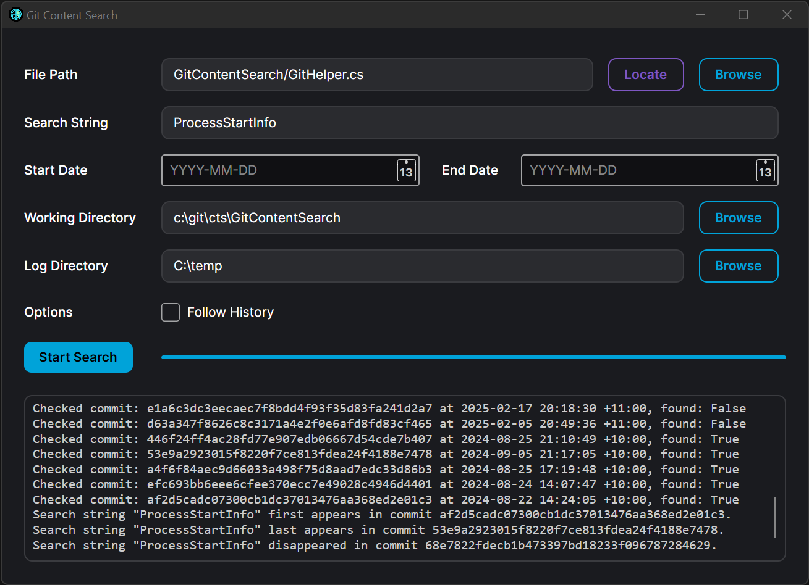

# GitContentSearch: Find When a String Was Added and Removed in Git History (Excel & Text)

Welcome to **GitContentSearch**, a free, powerful tool designed to pinpoint the exact Git commits where a specific string was *first introduced* and *last removed* from your files. It works with both legacy Excel files (.xls, .xlsx) and text-based files (.txt, .sql, .cs, etc.), making it an indispensable tool for understanding the history of your code and data. GitContentSearch goes beyond `git blame`, providing a fast, binary-search-driven way to find the origin and deletion of any string within your repository's history.

> **Note**: This tool is primarily tested on Windows and may not work properly on Linux/MacOS yet. Cross-platform support is planned for future releases.



## Why Use GitContentSearch?

GitContentSearch excels at identifying the *precise* commits responsible for adding and removing specific content, even within binary files like Excel. This capability is invaluable when `git blame` alone isn't enough, especially when dealing with:

*   **Legacy Excel Data:** Understand how and when specific data entries or formulas were changed in Excel files.
*   **Refactoring and Code Changes:** Quickly find where a particular function, variable, or configuration setting was first introduced and later removed.
*   **Troubleshooting:** Pinpoint the commit that introduced a bug or unexpected behavior by searching for the relevant code.
*   **Auditing and Compliance:** Demonstrate when and why specific changes were made to critical files.

GitContentSearch logs its progress, allowing you to resume searches if interrupted, a crucial feature for large repositories.  **It has been successfully tested on repositories with over 200,000 commits and Excel files up to 10MB in size**, demonstrating its ability to handle substantial projects.

## Key Features

- **Dual Interfaces**: Use the CLI for automation and scripting, or the modern UI for a visual experience.
- **Fast Binary Search**: Rapidly identifies the *first* and *last* commits where a search string appears.
- **Multi-File Support**: Search Excel files (.xls, .xlsx) and text files (.txt, .sql, .cs, etc.).
- **Search Log**: Tracks all checked commits and results, stored in a log file for easy resumption.
- **Custom Commit Range**: Specify an earliest and latest commit to narrow the search scope.
- **File History Tracking**: Use the `--follow` option (CLI) or UI toggle to trace file renames and movements across commits.

## Download Windows Binaries

Get started today with the free Windows binaries available on the [releases page](https://github.com/EntityProcess/GitContentSearch/releases/latest):

- **CLI**: [GitContentSearch_CLI_win_x64.zip](https://github.com/EntityProcess/GitContentSearch/releases/latest)
- **GUI**: [GitContentSearch_UI_win_x64.zip](https://github.com/EntityProcess/GitContentSearch/releases/latest)

Build the tool yourself using the steps below for enhanced security.

## Installation Guide

### Step 1: Clone the Repository
Clone the GitContentSearch repo to your local machine:
```bash
git clone https://github.com/EntityProcess/GitContentSearch.git
cd GitContentSearch
```

### Step 2: Build the Application
Compile the tool using .NET:

```bash
dotnet publish -c Release
```

### CLI Installation
The CLI executable will be located at:

```
/path/to/your/git/repository/GitContentSearch/bin/Release/netX.X/publish/
```
Add this folder to your PATH environment variable for easy access from any command line.

### UI Installation
The UI executable will be at:

```
/path/to/your/git/repository/GitContentSearch.UI/bin/Release/netX.X/publish/
```
Create a desktop shortcut to `GitContentSearch.UI.exe` for convenience.

## How to Use GitContentSearch

### Using the UI Version
1.  Launch `GitContentSearch.UI.exe`.
2.  Configure your Git repository settings.
3.  Enter the file path and search string.
4.  Set optional commit range and search options.
5.  Click Search to start.

### Using the CLI Version
1.  **Navigate to Your Git Directory**
    Ensure you're in your Git repository:

    ```bash
    cd /path/to/your/git/repository
    ```
2.  **Run the Tool**
    Execute the CLI with your parameters:

    ```bash
    GitContentSearch.exe <remote-file-path> <search-string> [--earliest-commit=<commit>] [--latest-commit=<commit>] [--working-directory=<path>] [--log-directory=<path>] [--follow]
    ```

### CLI Arguments
*   `<file-path>`: Remote path to the file in the Git repo (e.g., `path/to/your/file.xlsx`).
*   `<search-string>`: The string to search for.
*   `--earliest-commit=<commit>`: (Optional) Earliest commit to start the search.
*   `--latest-commit=<commit>`: (Optional) Latest commit to end the search.
*   `--working-directory=<path>`: (Optional) Directory for Git commands (defaults to temp directory).
*   `--log-directory=<path>`: (Optional) Directory for logs and temp files (defaults to temp directory).
*   `--follow`: (Optional) Follow file renames and history.

### CLI Example

```bash
GitContentSearch.exe "path/to/your/file.xlsx" "SearchString" --earliest-commit=abc123 --latest-commit=def456 --working-directory="/your/git/repo" --log-directory="/your/log/directory" --follow
```
This searches for "SearchString" within the specified range, using custom directories, and follows file renames.

## Search Output
A `search_log.txt` file is created in the log directory, detailing checked commits and whether the string was found. Temporary files are also stored there.

## Dependencies
*   **Git**: Required for Git commands (ensure it’s installed).
*   **NPOI**: [NPOI](https://github.com/nissl-lab/npoi) enables Excel file processing (.xls, .xlsx).
*   **AvaloniaUI**: [AvaloniaUI](https://avaloniaui.net/) powers the cross-platform UI.

## Get Involved
Contributions are welcome! Submit a pull request or open an issue on the GitHub repository for bugs or feature requests. Help us improve GitContentSearch!